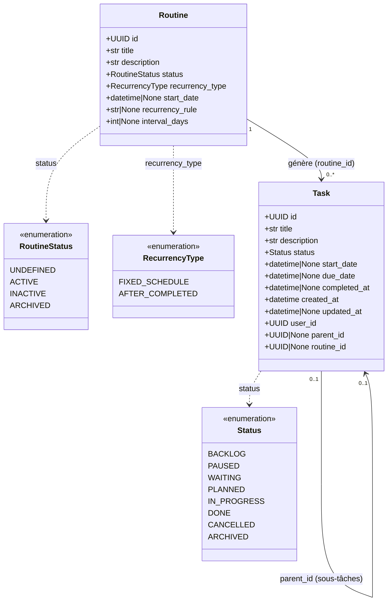
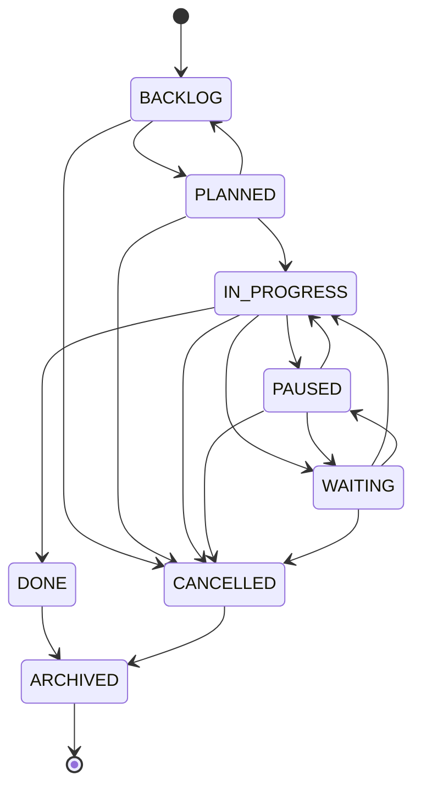

# Routine — rappel de modèle et de cycle de vie

**Source** : [`docs/brainstorms/2026-07-31-routine-recurring-tasks.md`](../brainstorms/2026-07-31-routine-recurring-tasks.md)
et son [log](../brainstorms/2026-07-31-routine-recurring-tasks.log.md).

Ce document synthétise l'état des décisions actées à date, à titre de préparation à
l'implémentation. Il présente le modèle **cible** (après correction du bug bloquant
Q13), pas l'état actuel du code — voir "État actuel vs cible" en fin de document.

## Modèle de données

Notes sur les champs `Routine` :

- `start_date` et `interval_days` sont **optionnels** (`datetime | None`, `int | None`)
  — correction du bug bloquant qui empêchait toute création de `Routine` (Q13).
  `interval_days` reste valide à `0` (`ge=0`, pas de minimum à 1 jour).
- `start_date` est pertinent pour **les deux** stratégies (pas seulement
  `FIXED_SCHEDULE`) : il sert d'ancre pour la `due_date` de la toute première Task
  générée, avant d'être écrasé par `now()` à chaque complétion suivante pour
  `AFTER_COMPLETED` (Q17). Selon `recurrency_type`, seul `recurrency_rule` /
  `interval_days` varie :
  - `FIXED_SCHEDULE` : `recurrency_rule` (RRULE, RFC 5545) + `start_date` requis,
    `interval_days` doit rester `None`.
  - `AFTER_COMPLETED` : `interval_days` + `start_date` requis, `recurrency_rule` doit
    rester `None`.
- `Task.routine_id` est le seul lien entre les deux entités, distinct de `parent_id`
  (réservé aux sous-tâches). Une Task "ouverte" d'une Routine est repérée par
  `routine_id` + `status not in (DONE, CANCELLED, ARCHIVED)`.

## Cycle de vie de `Routine`

```mermaid
stateDiagram-v2
    [*] --> UNDEFINED
    UNDEFINED --> ACTIVE: explicite\nstart_date définie ;\naucune Task à créer avec\ndue_date déjà passée ;\nconfig de récurrence cohérente
    ACTIVE --> INACTIVE: explicite, toujours autorisé\n→ cascade : Task ouvertes → CANCELLED
    ACTIVE --> ARCHIVED: explicite\nsi aucune Task ouverte restante\n(DONE, CANCELLED ou ARCHIVED)
    INACTIVE --> ARCHIVED: explicite, toujours autorisé
    INACTIVE --> ACTIVE: explicite\n→ delta : recrée les Task manquantes\n(clé (routine_id, due_date))
    ARCHIVED --> [*]
```

Points clés :

- `UNDEFINED` est un cul-de-sac partiel : aucune transition directe vers `INACTIVE` ou
  `ARCHIVED` (Q12) — une Routine jamais activée le reste jusqu'à son activation.
- `ACTIVE → INACTIVE` est **explicite** (action de désactivation par l'utilisateur), pas
  déclenché par un changement d'état des Task — c'est l'inverse : la désactivation
  **cascade** sur les Task ouvertes en les passant en `CANCELLED` (Q11). Le frontend
  affiche un avertissement avant cette action si des Task associées ne sont pas toutes
  `PLANNED`.
- `INACTIVE → ACTIVE` recrée les Task manquantes par calcul de delta plutôt que par
  regénération complète, en s'appuyant sur la clé naturelle `(routine_id, due_date)` et
  le statut `CANCELLED` pour ne pas recréer une occurrence volontairement annulée.
- Le déclencheur de génération d'une nouvelle Task (hors `FIXED_SCHEDULE` bornée) est
  la **complétion** de la Task courante — pas une lecture ni un scheduler. Exception :
  la toute première Task (aucune Task précédente à compléter) est créée dès que la
  Routine atteint `ACTIVE` pour la première fois (à la transition `UNDEFINED → ACTIVE`,
  ou directement à la création si `ACTIVE` est demandé dès le payload, cf. Q7/Q16).

### Pour mémoire : cycle de vie de `Task` (déjà implémenté)

`TaskService.delete` (règle à trois branches) : suppression physique uniquement depuis
`BACKLOG`, archivage implicite depuis `DONE`/`CANCELLED`, no-op depuis `ARCHIVED`, refus
(`409`) pour tout autre statut. C'est cette règle qui a motivé l'inversion de causalité
`ACTIVE → INACTIVE` ci-dessus (Q11).

## Exemples

### Exemple 1 — `FIXED_SCHEDULE` non bornée : réunion hebdomadaire

- Création : `recurrency_type=FIXED_SCHEDULE`, `recurrency_rule="FREQ=WEEKLY;BYDAY=MO;BYHOUR=9"`,
  `start_date=2026-08-03T09:00` (un lundi).
- `UNDEFINED → ACTIVE` (explicite) : validation OK → une première Task est due
  (`due_date=2026-08-03T09:00`, `status=PLANNED`, `routine_id=<id>`).
- L'utilisateur complète cette Task le 2026-08-03 (`PLANNED → IN_PROGRESS → DONE`).
- `update_start_date` avance `start_date` à la prochaine occurrence RRULE strictement
  future après `now()` : 2026-08-10T09:00 → nouvelle Task créée.
- Si la complétion arrive en retard (ex: le 2026-08-20, deux occurrences sautées),
  `start_date` saute directement à 2026-08-24 (prochaine occurrence future) : les
  occurrences du 10 et du 17 août ne sont pas rattrapées (alerte gérée côté frontend,
  Q14 — rien à faire côté backend).

### Exemple 2 — `AFTER_COMPLETED` : arroser les plantes tous les 3 jours

- Création : `recurrency_type=AFTER_COMPLETED`, `interval_days=3`,
  `recurrency_rule=None`, `start_date=2026-08-02T08:00` (due de la toute première Task).
- `UNDEFINED → ACTIVE` : première Task créée avec `due_date=2026-08-02T08:00`.
- Task complétée le 2026-08-05 → `start_date` de la Routine mis à `2026-08-05` (date de
  complétion, écrase la valeur initiale) → nouvelle Task due le `2026-08-08`
  (`start_date + interval_days`).
- Peu importe le retard éventuel de complétion : à partir de la deuxième occurrence, le
  calcul repart toujours de la date réelle de complétion, jamais d'un calendrier fixe
  (contrairement à `FIXED_SCHEDULE`).

### Exemple 3 — `FIXED_SCHEDULE` bornée : suivi sur 5 séances

- Création : `recurrency_rule="FREQ=WEEKLY;COUNT=5"`, `start_date` dans le futur.
- `UNDEFINED → ACTIVE` : les **5 Task sont créées immédiatement**, indépendantes les
  unes des autres (pas de mécanisme lazy, pas de règle "une seule Task ouverte").
  Compléter ou annuler l'une n'affecte pas les autres.

### Exemple 4 — Désactivation puis réactivation

- Routine `ACTIVE` avec une Task ouverte `PLANNED`.
- Utilisateur déclenche `POST /routines/{id}/inactive` → la Routine passe `INACTIVE`,
  la Task ouverte passe automatiquement `CANCELLED` (le frontend avait averti au
  préalable puisque la Task n'était pas dans un statut plus avancé que `PLANNED`).
- Plus tard, `POST /routines/{id}/active` → calcul de delta : la Task `CANCELLED`
  n'est **pas** recréée (clé `(routine_id, due_date)` déjà "consommée" par une Task
  annulée), seules les occurrences théoriques sans Task correspondante sont créées.

## Points relevés en préparant ce document (résolus depuis)

Deux incohérences repérées en rédigeant une première version de ce document ont été
tranchées depuis (Q16, Q17) — pour mémoire :

1. **Création de la toute première Task d'une Routine.** Le déclencheur de génération
   documenté (Q2) était uniquement "la complétion de la Task courante", ce qui ne
   couvrait pas la toute première activation. Tranché en Q16 : la première Task est
   créée dès que la Routine atteint `ACTIVE` pour la première fois.
2. **Condition `UNDEFINED → ACTIVE` pour `AFTER_COMPLETED`.** Le modèle interdisait
   `start_date` pour cette stratégie, en contradiction avec la condition générique de
   Q8. Tranché en Q17 : `start_date` est désormais accepté (et requis) pour les deux
   stratégies.

## État actuel vs cible

Ce document décrit l'état **cible** des décisions prises. Au moment de sa rédaction,
côté code :

- Le modèle `Routine` existe (non commité) mais **bloque toute création** (bug Q13, non
  corrigé).
- `Task.routine_id` **n'existe pas encore** sur le modèle `Task`.
- `RoutineService` **a été supprimé** de `services.py` (retiré lors de l'implémentation
  de `01-task-status-lifecycle.md`) — à reconstruire entièrement.
- Aucun router/schema pour `Routine`.
- Aucune migration Alembic pour la table `Routine` ni pour `Task.routine_id`.
